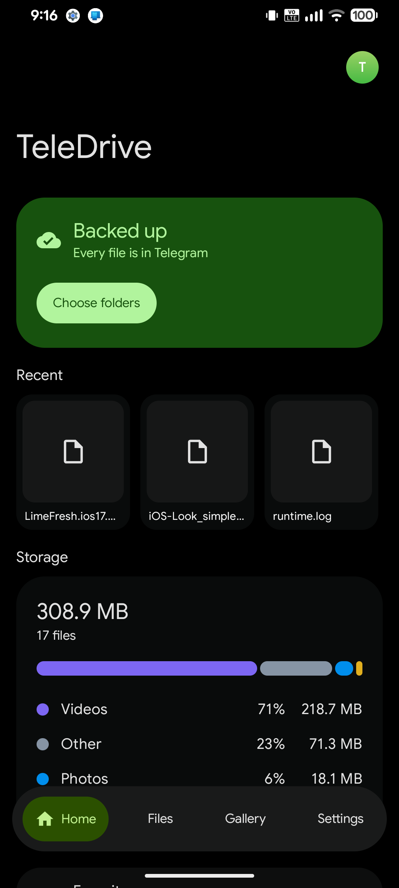
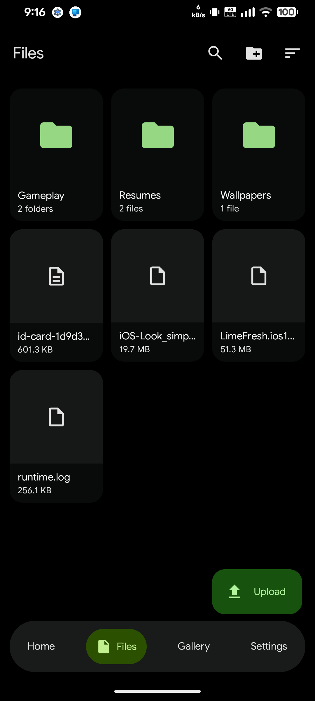
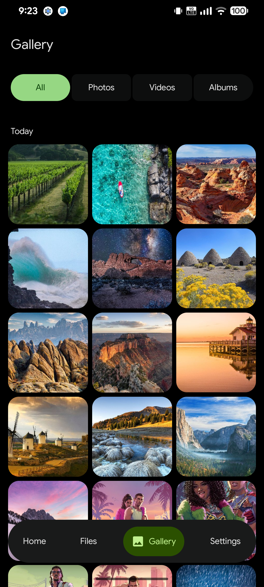
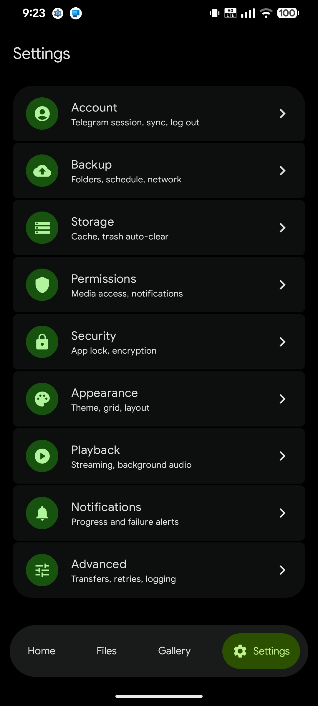

<div align="center">


# TeleDrive

Back up and browse your files using a private Telegram channel as storage.

[](#requirements)
[](https://kotlinlang.org)
[](https://developer.android.com/compose)
[](https://github.com/Mahmud0808/TeleDrive/releases/latest)
[](https://github.com/Mahmud0808/TeleDrive/releases)
[](LICENSE)
<br><br>
<a href="https://www.buymeacoffee.com/DrDisagree"></a>
</div>

---

## About

TeleDrive is an Android app that stores your files in a private Telegram channel
on your own account. There is no TeleDrive server and no account to create with
us. The app keeps a local index so browsing and search stay fast and work
offline.

With **Encrypt uploads** enabled, Telegram holds only sealed bytes, random file
names, encrypted captions and an encrypted folder tree.

## Features

**Storage on your own account.** Sign in by phone number or by scanning a QR
code from a Telegram app you are already signed in to. The app creates a private
storage channel and finds it again after a reinstall.

**Several drives, one account.** Keep more than one storage channel and switch
between them: personal and work, or photos and documents. Each drive has its own
file index, backup folders and settings, and nothing crosses between them. New
drives are created from Settings, and existing TeleDrive channels on the account
are found automatically. This is separate storage, not separate Telegram
accounts, since the app holds one session at a time.

**Backup that runs on its own.** Take a photo and it uploads, the way a cloud
gallery app behaves. The app does not have to be open or in recents: the system
wakes it when new media lands, and an hourly sweep catches anything a missed
wake-up would have skipped. It resumes after a reboot.

**Backup control.** DCIM, Pictures, Movies or any folder you choose, backed up
manually, on a schedule, or as files appear. Incremental by size, modified time
and SHA-256, so unchanged files are never uploaded twice. Wi-Fi-only and
charging-only constraints. Exclusion rules by file, folder, extension, MIME
type, glob pattern, size or hidden status.

**Recovery after a wipe.** Every upload carries a JSON manifest in its message
caption, and the folder tree is mirrored in its own state document. Reinstall,
sign in, and a rebuild restores folders, favorites, hidden and archived flags,
and trash state.

**Transfers.** A persistent Room-backed queue driven by WorkManager and a
foreground service. Parallel transfers, pause, resume, cancel, retry,
priorities, live speed and ETA. Survives process death and reboots.

**File management.** Nested folders, rename, move, copy, favorites, hidden and
archived items, bulk actions, trash with restore, grid and list layouts, pinch
to resize the grid, long-press-and-drag range selection, and sorting by name,
size, date, type or backup state.

**Sharing in and out.** TeleDrive appears in the Android share sheet, so files
arrive from any app and you pick the destination folder. Identical bytes are
never uploaded twice: a file already in the target folder is skipped, and one
that exists elsewhere in the drive is duplicated inside Telegram instead of
re-uploaded. Selected files can be shared back out to other apps.

**Storage insight.** The home screen breaks the drive down by photos, videos,
audio, documents, archives and anything else, with sizes and shares of the
total. Only the categories you actually have are listed.

**Gallery and playback.** Paged media grid with date grouping and a pinch-zoom
image viewer that swipes between shots in the order the grid shows them. Video
and audio play in a Compose player with playback speed, repeat, subtitle and
audio-track selection, aspect controls and rotation. Unencrypted media streams
directly from Telegram through ranged downloads instead of downloading in full
first, so playback starts without waiting for the whole file.

**Previews without leaving the app.** PDFs render page by page with zoom, pan
and working links. Text files open inline. ZIP archives list their contents with
sizes and compression. Images, video and audio all preview in place, and
anything without a viewer offers a download instead.

**Encryption.** Optional chunked AES-256-GCM for file bodies, encrypted caption
manifests, obfuscated remote file names, sealed thumbnails and an encrypted
folder tree. Keys are random and wrapped by an Android Keystore master key.
Encryption cannot be enabled without a passphrase-protected key backup (PBKDF2,
310k iterations) stored in your channel, so files stay recoverable on a new
device.

**Device security.** Biometric app lock with auto-lock timeout, optional
screenshot and screen-recording blocking, encrypted local database and
thumbnail cache.

## Screenshots

<div align="center">

| Home | Files | Gallery | Settings |
| :---: | :---: | :---: | :---: |
|  |  |  |  |

</div>

## Install

Grab an APK from the [releases page](../../releases). Builds are split per CPU
architecture, so pick the one that matches your device:

| APK | Use it when |
| --- | --- |
| `TeleDrive-<version>-arm64-v8a-release.apk` | Almost every phone from the last several years |
| `TeleDrive-<version>-armeabi-v7a-release.apk` | Older 32-bit devices |
| `TeleDrive-<version>-x86_64-release.apk` | 64-bit emulators and x86 Chromebooks |
| `TeleDrive-<version>-x86-release.apk` | 32-bit x86, rare outside older emulators |
| `TeleDrive-<version>-universal-release.apk` | You are unsure, or sideloading somewhere unusual |

The universal one carries every architecture at once, so prefer a specific build
unless you need the fallback. Most of that size is TDLib, the official Telegram
library the app is built on.

## Requirements

- Android 8.0 (API 26) or newer
- A Telegram account
- Your own Telegram API credentials, free from
  [my.telegram.org](https://my.telegram.org) under *API development tools*

To get credentials: sign in at [my.telegram.org](https://my.telegram.org), open
*API development tools*, and fill in an app name and short name. Anything
sensible works, and the platform and description do not matter. The page then
shows an **api_id** and an **api_hash**, which is what TeleDrive asks for on
first launch.

You enter the API ID and hash at runtime and they are stored encrypted on
device. They are never bundled into the app, written to logs, or sent anywhere
except Telegram. Because they are yours rather than shared, your usage is never
pooled with anyone else's, and a rate limit on someone else cannot affect you.

## Getting started

```bash
git clone https://github.com/Mahmud0808/TeleDrive.git
cd TeleDrive
./gradlew :app:installDebug
```

Then in the app:

1. Enter your API ID and hash.
2. Sign in, either by phone number and login code, or by choosing **Sign in by
   QR code**. If Telegram is installed on the same device, the QR step offers a
   **Confirm in Telegram** button instead, so nothing needs scanning.
3. Choose the folders to back up.
4. Optionally enable **Encrypt uploads** and set a recovery passphrase.

TDLib native libraries come from the prebuilt
[`tdlibx/td`](https://github.com/tdlibx/td) AAR via JitPack, so no NDK
build is needed.

## Architecture

Clean Architecture with MVVM and one package per screen. The dependency rule is
`presentation -> domain <- data`, with `core` shared by both sides. No TDLib
type leaves `core/telegram`.

```text
app/src/main/java/com/drdisagree/teledrive/
├── core/             # infrastructure
│   ├── common/           # typed errors, results, logging, notifications
│   ├── crypto/           # Keystore, streaming AEAD, key backup, KDF
│   ├── dispatchers/      # coroutine dispatcher provider
│   ├── files/            # mime, hashing, naming, storage stats
│   ├── media/            # thumbnails, Coil fetcher, Media3 Telegram source
│   ├── network/          # connectivity monitor
│   ├── permissions/      # runtime permission model and checks
│   ├── security/         # app lock state
│   ├── telegram/         # TelegramClient abstraction + TDLib implementation
│   └── transfer/         # transfer executor, workers, schedulers
├── data/
│   ├── local/            # Room entities, DAOs, queries, DataStore
│   ├── remote/           # caption manifest protocol, folder state
│   ├── mapper/           # entity to domain
│   └── repository/       # repositories, sync engine
├── domain/
│   ├── model/            # models and enums
│   ├── repository/       # interfaces
│   └── usecase/          # backup decisions, exclusions, validation
└── presentation/         # Compose UI, MVVM
```

Stack: Kotlin, Coroutines, Jetpack Compose, Material 3 Expressive, Hilt, Room,
DataStore, WorkManager, Paging 3, Media3, Coil, TDLib.

## Security model

| Layer | What is protected |
| --- | --- |
| On device | Room and TDLib databases sealed with a random, Keystore-wrapped key. Thumbnails and caches AES-GCM encrypted by default. |
| In Telegram | With encryption on, the channel holds only sealed bytes, random file names, encrypted captions and an encrypted folder tree. |
| Key custody | Content keys are random, wrapped by an Android Keystore master key, and never leave the device unwrapped. |
| Recovery | The content key is backed up to your channel, sealed with your passphrase (PBKDF2, 310k iterations). Restoring it on a new device unlocks everything. |

Someone who reads the channel without your key learns only the file count,
sizes and timestamps. The passphrase has no reset path, which is the point, so
set a hint when you create it and keep the passphrase out of the hint.

## Good to know

- Telegram caps files at 2 GiB, or 4 GiB with Premium. Oversized files fail
  immediately with the limit shown instead of uploading partially.
- Encrypted media downloads and decrypts before playing, so there is a wait and
  no seeking ahead until it finishes. Unencrypted media streams from Telegram
  immediately.
- Telegram cannot rename a document inside a sent message, so a rename updates
  the caption manifest, which is what a rebuild reads.
- TDLib cannot resume an interrupted upload, so pausing an upload restarts it.
  Downloads do resume.

## Testing

```bash
./gradlew testDebugUnitTest          # Unit tests covering crypto, key backup,
                                     # query building, backup decisions, naming
./gradlew connectedDebugAndroidTest  # Room DAO behaviour on a device
```

## Contributing

Issues and pull requests are welcome. Keep the dependency rule intact, match the
surrounding code style, and add tests for changes in `domain/` or
`core/crypto/`.

## License

[Apache License 2.0](LICENSE).

TDLib is BSL-1.0. The prebuilt Android wrapper (`tdlibx/td`) is Apache-2.0.

---

<div align="center">
<sub>TeleDrive is an independent project, not affiliated with or endorsed by Telegram.</sub>
</div>
